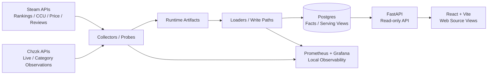

# Picking My Time Sink

## Project Snapshot

Picking My Time Sink는 Steam 데이터를 중심으로 수집·정규화·서빙하고, Chzzk category 관측 데이터를 단계적으로 확장하여 사용자가 게임을 구매하거나 플레이할 때 참고할 수 있는 근거를 제공하는 MVP 형태의 데이터 대시보드다.

- **Current baseline**: Steam-only baseline
- **Main data**: Steam rankings, CCU, price, reviews
- **Serving flow**: Postgres serving view → FastAPI endpoint → web source views
- **Chzzk status**: category-level observed facts와 read-only source API를 구현했으며, game mapping과 Combined KPI는 future work
- **Not implemented**: Combined KPI, Steam-Chzzk mapping
- **Candidate / Future work**: dbt, Dagster, ClickHouse
- **Public boundary**: provider raw payload, credentials, private runtime detail, host/path 세부 정보, scheduler XML/stdout, row-level UGC 제외

## Current Status

| Area | Status | Notes |
|---|---|---|
| Steam baseline | Implemented | rankings, CCU, price, reviews 수집·적재·서빙·web view 연결 |
| Chzzk observed source API | Partially implemented | category/channel observed facts와 `/chzzk/categories/overview` |
| Chzzk source view | In progress | Steam baseline 수준의 product baseline은 아님 |
| Mapping / Combined KPI | Not implemented | Steam-Chzzk mapping과 Combined KPI는 future work |
| dbt / Dagster / ClickHouse | Candidate / Future work | 조건부 검토 대상 |

## 현재 구현 범위

### Steam-only Baseline

Steam-only baseline은 현재 레포지토리에서 실제 사용 가능한 주요 베이스라인이다.

Steam source view, API, 그리고 serving view를 연결하여 누구나 읽기 전용으로 데이터를 탐색할 수 있는 브라우저 형태로 제공하는 것을 목표로 했으며, 현재 다음과 같은 흐름이 구현되어 있다.

* Steam provider 데이터 수집 및 Cadence-specific Ingestion 구현
* 추적 대상인 Steam 게임 목록(tracked Steam universe) 유지
* rankings, CCU, price, reviews 데이터 적재 및 정규화 수행
* Postgres serving view 및 FastAPI 기반의 읽기 전용 endpoint 제공
* 웹 source view에서 `Explore` 및 `Top Selling` 모드 구현
* null, warmup, missing, free-price 등의 데이터 상태를 Fake fallback으로 덮어쓰지 않고 있는 그대로 표시하는 UI 구현

Steam `Explore` 모드는 `/games/explore/overview` API를 중심으로 현재 CCU, 최근 7일 지표, Player-hours(CCU 기반 추정 누적 플레이 시간), 리뷰 증감 추이, 가격 데이터를 한 화면에서 비교할 수 있도록 제공한다.

`Top Selling` 모드는 현재 Steam KR 주간 최고 판매량(weekly top sellers) 스냅샷을 기준으로 데이터를 제공한다.

### Chzzk 관측 데이터 구현 범위

Chzzk 데이터는 아직 Steam baseline처럼 완성된 형태의 프로덕트 베이스라인으로 제공하지 않는다.

현재 구현된 데이터 수집 및 제공 범위는 다음과 같이 제한된다.

* Chzzk 카테고리 관측 데이터(observed facts)
* Chzzk 카테고리별 채널 관측 데이터
* 읽기 전용 관측 소스 API: `/chzzk/categories/overview`
* Guarded-write가 적용된 로컬 수집 파이프라인 관측

`/chzzk/categories/overview` endpoint는 카테고리 단위로 샘플링된 관측 지표를 반환한다.

채널 데이터는 카테고리 관측 주기와 일치할 경우에 한해, `unique_channels_observed`와 같은 nullable 지표를 보강하는 용도로만 사용된다.

이 API는 provider의 raw payload, 채널명, 방송 제목, 썸네일, 인증 정보, Steam 데이터와의 매핑 정보, 통합 필드(combined fields)를 노출하지 않는다.

데이터 수집 경로(guarded-write collection path)는 로컬 운영 관측 범위에서 제한적으로 검증했다.

공개된 README에서는 이를 "Bounded local operational observation(제한적 로컬 운영 관측)이 진행된 수집 경로"로 요약하며, 스케줄러의 raw 데이터나 프라이빗 런타임의 세부 구현은 공개하지 않는다.

### Chzzk Source-View 확장

Chzzk source view는 현재 개발이 진행 중인 영역이다.

API 및 웹의 일부 단위 기능은 검증을 마쳤으나, Steam-only baseline 수준의 완성된 사용 가능 베이스라인으로 간주하지는 않는다.

현재 의미 있는 성과는 Chzzk 카테고리 테이블이 관측된 지표를 읽어오고, Bounded sample caveat(제한된 샘플링으로 인한 한계점) 및 데이터 수집 범위를 명확히 분리하여 보여주는 방향성을 검증했다는 점이다.

정기 수집의 안정화, source view의 완성, 그리고 카테고리와 게임 간의 매핑은 향후 과제로 남겨두었다.

## Architecture

아래 다이어그램은 현재 MVP의 주요 데이터 흐름을 요약한 것이다.

현재 MVP의 아키텍처는 거대한 플랫폼을 구축하기보다, 작지만 확실히 검증 가능한 vertical slice를 구현하는 데 우선순위를 둔다.

* **Collectors / probes**: Steam의 ranking, CCU, price, reviews 데이터 수집과 Chzzk의 라이브 목록 및 카테고리 데이터 탐색(probe)을 담당한다.
* **Loaders / write paths**: provider의 아티팩트를 bronze/silver/gold 계층이나 fact table 형태로 정규화하여 Postgres에 적재한다.
* **Postgres serving / metadata DB**: fact table, 집계 테이블, 최신 serving view 및 API의 읽기 모델을 관리하는 메인 저장소다.
* **API layer**: FastAPI 라우터를 통해 Steam 및 Chzzk의 읽기 전용 endpoint를 제공한다.
* **Web source views**: React와 Vite 기반의 대시보드로 Steam의 `Explore` 및 `Top Selling` 화면을 제공하며, Chzzk의 관측된 카테고리 source view는 제한된 범위에서 확장 중이다.
* **Runtime**: Recurring runtime은 로컬 환경에서 lightweight scheduler 기반으로 실행되며, 정기 수집 경로의 동작을 검증하는 데 사용한다.
* **Artifact handoff**: Object storage 기반 handoff는 현재 공식 저장소 런타임이 아니라, 원격 작업과 휴대 가능한 최신 스냅샷 검토를 돕기 위한 보조 경로로만 활용한다.
* **Local observability**: 로컬 스케줄러의 상태와 데이터의 최신화 상태를 모니터링하기 위해 Prometheus와 Grafana를 관측 도구로 활용한다.
* **DuckDB**: 프로덕션 serving을 대체하는 용도가 아니며, 로컬이나 프라이빗 환경에 보관된 아티팩트를 재계산하거나 문제 상황을 분석(triage)하기 위한 제한적인 읽기 전용 도구(bounded read-only helper)로 사용한다.

## 현재 API

현재 API 목록은 레포지토리의 라우터에 실제 구현되어 있는 endpoint만 포함하고 있다.

### Steam

* `GET /games/explore/overview`
* `GET /games/rankings/latest`
* `GET /games/ccu/latest`
* `GET /games/{canonical_game_id}/ccu/latest`
* `GET /games/{canonical_game_id}/ccu/daily-90d`
* `GET /games/price/latest`
* `GET /games/{canonical_game_id}/price/latest`
* `GET /games/reviews/latest`
* `GET /games/{canonical_game_id}/reviews/latest`

### Chzzk

* `GET /chzzk/categories/overview`

Combined API는 아직 구현된 API가 아니다.

Combined 소스 및 KPI 체계 구축은 예정된 작업으로 분리해 두었다.

## 검증과 품질 관리

주요 변경은 성격에 따라 `poetry run ruff check .`, `poetry run pytest`, `cd web && npm run build` 같은 명령으로 확인한다.

운영 관련 확인은 local read-only smoke와 checkpoint 중심으로 수행하며, public README에는 raw payload, private runtime detail, credential, scheduler XML/stdout, row-level UGC를 남기지 않는다.

## 향후 작업

다음 항목들은 향후 개발을 목표로 하는 과제이며, 아직 구현되지 않았다.

* Chzzk regular collection 안정화
* Chzzk source view 완성
* 카테고리와 게임 간의 매핑
* Combined 소스 및 KPI 체계
* dbt Core 기반의 Bounded(도메인별) 모델링, 테스트 및 문서화
* Dagster를 활용한 데이터 오케스트레이션 및 컨트롤 플레인 파일럿 구현

## 조건부 향후 과제

### 현재 제한적으로 사용 중인 보조 도구

* **DuckDB**: 현재는 프로덕션 serving이 아니라 제한적인 읽기 전용 재계산 및 점검 도구로 사용한다. 이후 Parquet 기반 아티팩트나 구체적인 재계산 경로가 필요해질 때 활용 범위를 확장할 수 있다.

### 향후 도입 검토 도구

* **Dagster**: 현재 정기 실행의 기준은 Windows Task Scheduler와 WSL2이며, 이를 바로 대체하는 런타임은 아니다. Steam과 Chzzk의 정기 수집 경로가 안정화된 뒤, 개발 및 운영 제어를 돕는 작은 pilot으로 검토한다. Airflow는 같은 문제를 해결할 수 있는 대체 orchestrator 후보로만 본다.
* **Loki**: Prometheus와 Grafana를 통한 지표 관측이 안정화된 후, Recurring file logs 관리가 운영상 병목을 일으킬 때 도입을 검토할 중앙 집중식 로그 관리(centralized logs) 후보군이다.
* **ClickHouse**: Postgres와 DuckDB의 범위를 넘어서는 대규모 과거 데이터에 대한 OLAP 병목 현상이 실제로 확인될 경우 도입을 검토한다.
* **Garage**: 현재 운영 중인 아티팩트 런타임은 아니며, 향후 S3 호환 아티팩트 저장소에 대해 자체 호스팅(self-hosted) 기반의 대안이나 마이그레이션이 필요할 때 고려할 옵션이다.
