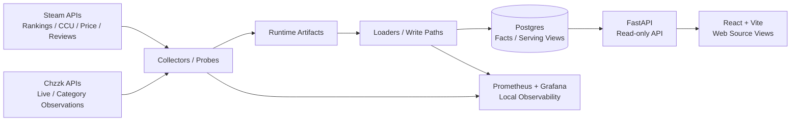

# Picking My Time Sink

## 프로젝트 개요

Picking My Time Sink는 Steam 데이터를 중심으로 수집·정규화·서빙하고, Chzzk 카테고리 관측 데이터를 단계적으로 확장하여 사용자가 게임을 구매하거나 플레이할 때 참고할 수 있는 데이터 기반의 MVP 대시보드다.

- **현재 기준(Baseline)**: Steam 데이터 중심 베이스라인
- **주요 데이터**: Steam 랭킹, 동시 접속자 수(CCU), 가격, 유저 리뷰
- **데이터 흐름**: Postgres serving view → FastAPI 엔드포인트 → 웹 소스 뷰
- **Chzzk 연동 현황**: 카테고리별 관측 데이터와 읽기 전용 API를 bounded 범위에서 구현했고, 게임 mapping과 통합 KPI 산정은 향후 과제
- **미구현 항목**: 통합(Steam + Chzzk) KPI, Steam-Chzzk mapping
- **Mapping 설계 범위**: `docs/decisions/category-to-game-mapping-contract.md`에 카테고리-게임 mapping 설계 가이드라인만 문서화했으며, 실제 구현 및 자동 mapping, 통합 데이터 활용 등은 아직 지원하지 않음
- **도입 검토 기술(Future work)**: dbt, Dagster, ClickHouse
- **비공개 범위**: provider raw payload, credentials, private runtime detail, host/path 세부 정보, 스케줄러 XML/로그, row-level UGC 제외

## 현재 상태

| 영역 | 상태 | Notes |
|---|---|---|
| Steam 베이스라인 | 구현 완료 | 랭킹, CCU, 가격, 리뷰 수집·적재·서빙·웹 뷰 연동 |
| Chzzk 관측 API | 일부 구현 | 카테고리/채널 관측 데이터와 읽기 전용 `/chzzk/categories/overview` 제공 |
| Chzzk 관측 소스 뷰 | 제한적 구현 완료 | 카테고리 중심의 관측 데이터 브라우저, `/chzzk/categories/overview` 기반, Steam 수준의 메인 베이스라인은 아님 |
| Mapping / 통합 KPI | 미구현 | 카테고리-게임 mapping 구조 설계 단계, Steam-Chzzk mapping 및 통합 KPI는 향후 과제 |
| dbt / Dagster / ClickHouse | 검토 중 | 인프라 확장 시 조건부 검토 대상 |

## 현재 구현 범위

### Steam 중심 베이스라인 (Steam-only Baseline)

현재 repo에서 즉시 실행 및 탐색이 가능한 핵심 기능이다.

Steam 소스 뷰, API, Serving View를 엮어 누구나 읽기 전용으로 데이터를 훑어볼 수 있는 브라우저 형태의 UI를 제공하며, 구체적인 구현 흐름은 다음과 같다.

* Steam 데이터 수집 및 수집 주기별 파이프라인 구현
* 추적 대상 Steam 게임 목록(Tracked Steam Universe) 관리
* 랭킹, CCU, 가격, 리뷰 데이터 적재 및 정규화
* Postgres Serving View 및 FastAPI 기반의 읽기 전용 엔드포인트 제공
* 웹 소스 뷰 내 `Explore` 및 `Top Selling` 모드 구현
* Null, 웜업(Warmup), 누락, 무료 게임 등의 데이터 상태를 임의의 더미 데이터로 대체하지 않고, 있는 그대로 투명하게 노출하는 UI 구성

Steam `Explore` 모드는 `/games/explore/overview` API를 기반으로 현재 CCU, 최근 7일 지표, 누적 플레이 시간(CCU 기반 추정치), 리뷰 증감 추이, 가격 변동을 한 화면에서 비교할 수 있도록 지원한다.

`Top Selling` 모드는 현재 Steam KR 주간 최고 판매량(Weekly Top Sellers) 스냅샷을 기준으로 데이터를 시각화한다.

### Chzzk 관측 데이터 구현 범위

Chzzk 데이터는 아직 Steam 베이스라인처럼 완성도 높은 프로덕트 기능으로 제공되지 않는다.

현재 구현된 데이터 수집 및 제공 범위는 다음과 같이 제한된다.

* Chzzk 카테고리 관측 데이터(observed facts)
* Chzzk 카테고리별 채널 관측 데이터
* 읽기 전용 API: `/chzzk/categories/overview`
* 로컬 수집 파이프라인 검증 (안정 장치가 적용된 Guarded-write 방식)

`/chzzk/categories/overview` 엔드포인트는 카테고리 단위로 샘플링된 관측 지표를 반환한다.

채널 데이터는 카테고리 관측 주기와 일치하는 경우에 한해, `unique_channels_observed` 같은 Nullable 지표를 보완하는 용도로만 제한적으로 활용된다.

이 API는 프로바이더의 Raw Payload, 채널명, 방송 제목, 썸네일, 인증 정보, 그리고 Steam 데이터와의 매핑 정보 및 통합 필드(Combined Fields)를 외부로 노출하지 않는다.

데이터 수집 경로는 로컬 운영 환경에서 제한적으로 검증을 마쳤다.

public README에는 이를 "제한적 로컬 운영 관측(Bounded local operational observation)이 진행된 수집 경로"로 요약하며, 스케줄러의 Raw 데이터나 프라이빗 런타임의 세부 구현은 공개하지 않는다.

### Chzzk 소스 뷰 구현 범위

Chzzk 관측 소스 뷰는 제한적으로 구현된(Bounded) 카테고리 중심의 데이터 브라우저다.

API와 웹의 소스 뷰 기능은 `/chzzk/categories/overview`를 기반으로 미니멀하게 구현되었으며, Steam 베이스라인 수준의 정식 프로덕트 스펙으로 간주하지 않는다.

현재 단계에서의 성과는 Chzzk 카테고리 테이블에서 관측된 지표를 정상적으로 읽어오는 구조를 다지고, 샘플링 제한에 따른 한계점(Bounded sample caveat) 및 데이터 수집 범위를 화면에 명확히 분리하여 보여주는 방향성을 검증했다는 점이다.

정기 수집 파이프라인 및 Write-path 안정화, 카테고리-게임 매핑, 통합 KPI 시스템 구축은 향후 과제로 남겨두었다.

## Architecture

아래 다이어그램은 현재 MVP의 주요 데이터 흐름을 요약한 것이다.

본 MVP는 거대한 플랫폼을 설계하기보다, 작지만 확실하게 검증 가능한 버티컬 슬라이스를 구축하는 데 집중한다.

* **Collectors / probes**: Steam의 랭킹·CCU·가격·리뷰 데이터 수집과 Chzzk의 라이브 목록·카테고리 데이터 탐색(Probe)을 담당한다.
* **Loaders / write paths**: 수집된 아티팩트(Artifact)를 정규화하여 Postgres 팩트 테이블(fact table) 형태로 적재한다.
* **Postgres serving / metadata DB**: 팩트 테이블, 집계 테이블, 최신 Serving View 및 API의 읽기 모델(Read Model)을 관리하는 메인 저장소다.
* **API layer**: FastAPI 라우터를 통해 Steam 및 Chzzk의 읽기 전용 엔드포인트를 제공한다.
* **Web source views**: React와 Vite 기반의 대시보드다. Steam의 `Explore` 및 `Top Selling` 화면을 제공하며, Chzzk 데이터는 제한적인 카테고리 전용 브라우저 형태로 노출한다.
* **Runtime**: 정기 수집 프로세스는 로컬 환경에서 경량 스케줄러(Lightweight Scheduler) 기반으로 실행되며, 수집 경로의 유효성을 검증하는 용도로 쓴다.
* **Artifact handoff**: 오브젝트 스토리지(Object Storage) 기반의 데이터 핸드오프는 원격 작업 및 최신 스냅샷 검토를 돕기 위한 보조 경로일 뿐, 공식 런타임 저장소는 아니다.
* **Local observability**: 로컬 스케줄러의 상태와 데이터 최신화 여부를 모니터링하기 위해 Prometheus와 Grafana를 활용한다.
* **DuckDB**: 프로덕션 서빙용 DB가 아니며, 로컬이나 프라이빗 환경에 저장된 아티팩트를 재계산하거나 이슈를 추적(Triage)할 때 쓰는 제한적인 읽기 전용 헬퍼(Helper) 도구다.

## 현재 API

현재 API 목록은 repo 라우터에 실제 구현되어 있는 엔드포인트만 포함하고 있다.

### Steam

* `GET /games/explore/overview`
* `GET /games/rankings/latest`
* `GET /games/ccu/latest`
* `GET /games/{canonical_game_id}/ccu/latest`
* `GET /games/{canonical_game_id}/ccu/daily-90d`
* `GET /games/price/latest`
* `GET /games/{canonical_game_id}/price/latest`
* `GET /games/reviews/latest`
* `GET /games/{canonical_game_id}/reviews/latest`

### Chzzk

* `GET /chzzk/categories/overview`

### Combined

통합 API(Combined API) 및 KPI 체계 구축은 예정된 후속 작업으로 분리되어 있으며, 현재는 미구현이다.

## 검증과 품질 관리

코드 변경 시 기본 검증은 레포지토리 루트에서 `./scripts/check.sh`를 실행하여 확인한다.

해당 스크립트는 아래의 핵심 점검 과정을 순차적으로 수행한다.

`./scripts/check.sh`는 focused checks를 순서대로 실행한다.

* `./scripts/check-python.sh`: Ruff 및 Pytest 기반의 Python 코드 검증
* `./scripts/check-web.sh`: 웹 린트(Lint) 및 TypeScript/Vite 빌드 검증 (`npm --prefix web run lint`, `npm --prefix web run build`)

작업 성격에 따라 개별 스크립트를 먼저 실행할 수 있지만, 최종 검증은 항상 `./scripts/check.sh`를 기준으로 삼는다.

운영 상태 확인은 로컬 환경에서의 읽기 전용 스모크 테스트(Smoke test)와 체크포인트 중심으로 진행하며, 퍼블릭 README에는 Raw Payload, 프라이빗 런타임 상세, 인증 정보, 스케줄러 XML/로그, 로우 레벨 UGC를 남기지 않는다.

## 향후 작업

다음 항목들은 향후 개발을 목표로 하는 과제이며, 아직 구현되지 않았다.

* Chzzk 정기 수집 파이프라인 및 Write-path 안정화
* 카테고리-게임 mapping
* 통합 소스 및 KPI 시스템 (Combined system)
* dbt Core 기반의 도메인별(Bounded) 모델링, 테스트 및 문서화
* Dagster를 활용한 데이터 오케스트레이션 및 컨트롤 플레인 파일럿 구현

## 조건부 향후 과제

### 현재 제한적으로 사용 중인 보조 도구

* **DuckDB**: 현재는 프로덕션 serving이 아니라 제한적인 읽기 전용 재계산 및 점검 도구로만 쓰고 있다. 이후 Parquet 기반 아티팩트나 구체적인 재계산 경로가 필요해질 때 활용 범위를 확장할 수 있다.

### 향후 도입 검토 도구

* **Dagster**: 현재 정기 실행은 기존 로컬 운영 런타임 기준으로 운영 중이며, Dagster가 이를 즉시 대체하는 것은 아니다. Steam과 Chzzk의 정기 수집 경로가 안정화된 후, 개발 및 운영 제어를 돕는 작은 파일럿으로 검토한다. Airflow는 같은 문제를 해결할 수 있는 대체 오케스트레이터 후보로 본다.
* **Loki**: Prometheus와 Grafana를 통한 지표 모니터링이 안정화된 후, 주기적인 파일 로그 관리가 운영상 병목을 일으킬 때 도입을 검토할 중앙 집중식 로그 관리(Centralized logs) 후보 도구다.
* **ClickHouse**: Postgres와 DuckDB의 한계를 넘어서는 대규모 과거 데이터에 대한 OLAP 병목 현상이 실제로 확인될 경우 도입을 검토한다.
* **Garage**: 현재 운영 중인 아티팩트 런타임은 아니며, 향후 S3 호환 아티팩트 저장소에 대해 자체 호스팅(self-hosted) 기반의 대안이나 마이그레이션이 필요할 때 고려할 옵션이다.
